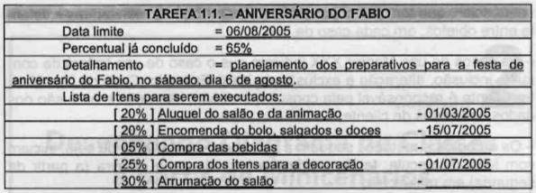

# Laboratório 02: Modelando com UML

Elabore o diagrama de caso de uso e de classes dos exercícios abaixo.

## Exercício 01: Controle de Tarefas

Arnaldo deseja escrever uma aplicação de controle de tarefas para colocar em seu Palm. 

As especificações da aplicação são as seguintes:

O cadastro de cada tarefa contém o número da prioridade, representado por um
valor real. Isso permite entrar com intervalos intermediários. Além da
prioridade, o cadastro deve conter: o nome da tarefa, a data limite de execução
(se houver), o percentual já concluído e o detalhamento da tarefas.

Para cada tarefa há uma lista de itens que descrevem sua execução. 
Para cada item de execução, cadastram-se:

1. O percentual correspondente
2. A descrição da execução
3. A data da execução (quando foi concluído)

Quando uma tarefa receber 100% de execução, esta deve ser modificada
automaticamente para a lista de tarefas concluídas, podendo ser apagada, se for
o caso.

Veja o exemplo desse controle no papel:

## Exercício 02: Festas Infantis

Rafaela possui vários temas de festas infantis para aluguel.

Ela precisa controlar os aluguéis e para isso quer uma aplicação que permita
cadastrar: o nome e o telefone do cliente, o endereço completo da festa, o tema
escolhido, a data da festa, a hora de início e término da festa.

Além disso, para alguns clientes antigos, Rafaela oferece descontos. Sendo
assim, é preciso o valor realmente cobrado nun determinado aluguel.

Para cada tema de festa, é preciso controlar: a lista de itens que compõem o
tema (ex: castelo, boneca da Cinderela, bruxa, etc), o valor do aluguel e a cor
da toalha de mesa que deve ser usada com o tema.

## Exercício 03: Cursos de Aperfeiçoamento

Uma empresa oferece cursos diversos de aperfeiçoamento profissional. 

O dono precisa controlar, inicialmente: os cursos oferecidos, a data de início e
término, o horário de início e término, o nome e o telefone celular do professor
e o valor da sua hora/aula.

Para cada curso, deve-se controlar: a carga horária, o conteúdo programático e o
valor do curso. Também é necessário ter o controle da matrícula e do cadastro de
alunos. 

Para matrícula cadastram-se: data da matrícula, valor pago, aluno e a turma. 

O cadastro de aluno compreende: nome, número da carteira de identidade, CPF,
data de nascimento, endereço completo e telefones de contato.

